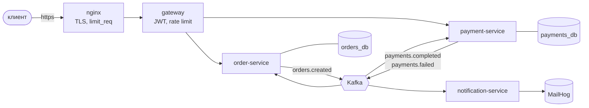
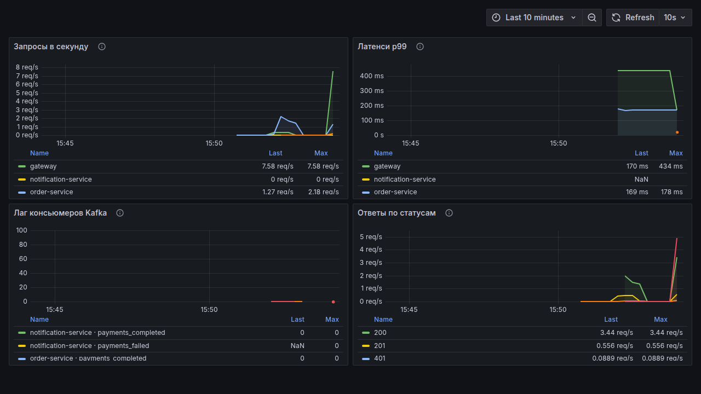

# PayFlow

[](https://github.com/tabyreto4k/payflow/actions/workflows/ci.yml)
[](https://github.com/tabyreto4k/payflow/actions/workflows/codeql.yml)
[](https://github.com/tabyreto4k/payflow/actions/workflows/release.yml)
[](LICENSE)
[](build-logic/src/main/kotlin/payflow.java-conventions.gradle.kts)

Упрощённый биллинг маркетплейса на микросервисах: заказ создаётся, деньги списываются со
счёта, заказ переходит в `PAID`, уходит уведомление. Обмен асинхронный, ни одно событие
не теряется, повторная доставка не списывает деньги дважды.

> **Статус:** проект собран целиком. Сценарий проверки — [docs/requests.http](docs/requests.http),
> он же скриптом: [scripts/e2e-saga.sh](scripts/e2e-saga.sh).



Синхронных вызовов между сервисами нет ни одного: order-service и payment-service общаются
только событиями. У каждого своя база, кросс-запрос невозможен на уровне прав
([ADR 0002](docs/adr/0002-database-per-service.md)).

## Стек

Java 21 · Spring Boot 3.5 · Spring Cloud Gateway · PostgreSQL 16 + Liquibase · Kafka ·
Redis · nginx · Prometheus + Grafana · JUnit 5 + Testcontainers · Gradle (Kotlin DSL) ·
Docker · GitHub Actions

## Модули

| Модуль | Роль |
|---|---|
| `gateway` | маршрутизация, JWT-фильтр, rate limiting через Redis |
| `order-service` | заказы, статусная модель, transactional outbox |
| `payment-service` | счета, списание, идемпотентность по ключу запроса |
| `notification-service` | письма об исходе оплаты, дедуп событий в Redis |
| `events-contract` | records событий — единственный общий модуль |

## Запуск

```bash
cp .env.example .env      # пароли и JWT_SECRET надо заполнить: пустые не примут
./scripts/gen-certs.sh    # self-signed сертификат для nginx
docker compose up -d --wait
./scripts/e2e-saga.sh     # весь сценарий через периметр
```

Наружу торчит только nginx: `https://localhost` (сертификат self-signed, поэтому
`curl -k`). Порты `gateway`, `order-service` и `payment-service` доступны лишь внутри
сети compose — доверие к заголовкам `X-Customer-Id`/`X-Roles` держится ровно на этом.

Swagger UI — один на весь периметр: <https://localhost/swagger-ui.html>, переключатель
сервисов в правом верхнем углу. Спеки отдают сами сервисы
(`/v3/api-docs/orders`, `/v3/api-docs/payments`), gateway их только маршрутизирует.

Рядом поднимается инфраструктура: postgres (`5432`), kafka (`29092` с хоста,
`kafka:9092` внутри сети), redis (`6379`), mailhog (`8025` — веб-интерфейс),
prometheus (`9090`), grafana (`3000`). Письма об оплате видно там же, в MailHog:
<http://localhost:8025>.

Образы каждой ревизии `main` — в GHCR: `ghcr.io/tabyreto4k/payflow/<сервис>:main`.

## Что проверяет сценарий

`scripts/e2e-saga.sh` идёт снаружи, через nginx, и проверяет шесть вещей за один прогон:

1. Регистрация и логин выдают пару токенов.
2. Заказ на 40 при балансе 100 доходит до `PAID`, баланс становится 60, на адрес
   покупателя приходит письмо.
3. Заказ на 1000 при балансе 60 приводит к `CANCELLED`, баланс не меняется, приходит
   второе письмо — об отказе.
4. Запрос без токена получает 401.
5. Запрос с подделанным `X-Customer-Id` получает 401: gateway срезает клиентские заголовки.
6. Серия из 150 запросов подряд упирается в 429.

Заказ двигают не ответы HTTP, а события: скрипт опрашивает статус, пока сага не отработает.
Ручной вариант того же — [docs/requests.http](docs/requests.http).

## Наблюдаемость

Prometheus снимает метрики со всех четырёх сервисов по `/actuator/prometheus`, дашборд
приезжает провижинингом и открывается на <http://localhost:3000> без ручной настройки.
Четыре панели: запросы в секунду, p99, лаг консьюмеров Kafka и ответы по статусам —
на последней видно и 401 без токена, и 429 от ограничителя.



Логи структурные, в формате ECS. Сквозной идентификатор запроса заводит gateway (или берёт
`X-Request-Id` от nginx), дальше он живёт в MDC, уезжает заголовком записи Kafka и
поднимается обратно в MDC у потребителей. Один поход клиента собирается из логов трёх
сервисов, между которыми нет ни одного синхронного вызова:

```bash
docker compose logs --no-log-prefix order-service | jq -r 'select(.correlationId=="<id>") | .message'
```

## Разработка

```bash
./gradlew build              # компиляция, spotless, checkstyle, unit-тесты, jacoco
./gradlew integrationTest    # Testcontainers, нужен запущенный Docker
./gradlew spotlessApply
```

JDK 21 на машине иметь не обязательно: тулчейн скачает нужный сам.

## Периметр

```
клиент → nginx (TLS, gzip, limit_req) → gateway (JWT, rate limit) → сервисы
```

Токены выпускает `order-service`: auth — его фича, отдельного сервиса нет. Пользователи
уже требуют JPA, Postgres и Liquibase, а gateway реактивный — держать их там значило бы
тащить туда R2DBC или блокирующий JPA в event-loop.

Gateway токены только проверяет. Валидный access превращается в `X-Customer-Id` и
`X-Roles`; клиентские заголовки с этими именами срезаются всегда, включая открытые пути.
Сервисы за периметром этим заголовкам доверяют и своей аутентификации не делают.

nginx перед gateway не дублирует его: терминация TLS, gzip, грубый лимит по адресу и
защита от медленных клиентов — работа периметра, а не маршрутизатора.

## Уведомления

`notification-service` слушает `payments.completed` и `payments.failed` напрямую: своего
топика у уведомлений нет, второго потребителя у него не было бы, а лишний хоп и продюсер-код
были бы абстракцией «на будущее».

Адресат едет в самом событии. Email знает только `order-service` — он и кладёт его в
`OrderCreatedEvent`, `payment-service` перекладывает в исход оплаты. Альтернатива —
сходить за адресом в чужой сервис — сломала бы правило «сервисы не знают друг о друге»
и добавила бы синхронную зависимость в асинхронный путь.

Своей БД у сервиса нет: повторную доставку отсекает Redis, `SET NX EX` по `eventId` с TTL
в сутки. **Гарантия здесь честно слабее, чем у остальных сервисов:** те держат
`processed_events` в своей базе и переживают что угодно, а потеря Redis означает, что
письмо может уйти второй раз. Для уведомления это приемлемо — деньги не движутся, — а
таблица с Liquibase ради одной колонки не окупалась бы.

Недоступный SMTP — не повод терять письмо: три попытки с растущей паузой, дальше
сообщение уезжает в `<топик>.DLT` с ERROR-логом. Отметка идемпотентности при неудачной
отправке снимается, иначе повтор из Kafka приняли бы за дубль.

## Кэш баланса — и почему он здесь сомнителен

`GET /api/v1/accounts/{id}` читает через Redis: cache-aside, TTL минута, инвалидация на
обоих путях записи — и на пополнении через API, и на списании сагой, которое идёт мимо
`AccountService`.

Честно: **счёт — горячая запись, и кэш поверх него окупается редко.** Баланс меняется тем
же потоком событий, который его и читают, а значит, большая часть записей в кэше умирает
от инвалидации, не дожив до второго чтения. Кэш здесь стоит потому, что чтение баланса —
самый частый запрос витрины, и на нём видно, как устроен cache-aside; в продукте с такой
записью я бы сначала посмотрел на попадания и, скорее всего, снял его.

Что в нём сделано не наивно:
- запись выбрасывается **после коммита**, а не внутри транзакции. Иначе читающий успевает
  промахнуться, сходить в базу за ещё не изменённым балансом и положить в кэш старое
  значение — уже после инвалидации;
- в кэше лежит ответ целиком, вместе с `customerId`, поэтому владелец проверяется и на
  попадании: чужой счёт остаётся невидимым;
- нечитаемая запись (сменился формат ответа) не роняет чтение, а выбрасывается.

Гонка «промах — коммит — запись из промаха» остаётся: TTL в минуту её ограничивает, но не
устраняет. Убирается она либо блокировкой на ключ, либо отказом от кэша.

## Архитектурные решения

Каждая развилка записана отдельным ADR — с альтернативами, которые проиграли, и с ценой,
которую платит выбранный вариант.

| ADR | О чём |
|---|---|
| [0001](docs/adr/0001-multi-module-gradle.md) | один мультимодульный Gradle-билд вместо проекта на сервис |
| [0002](docs/adr/0002-database-per-service.md) | своя база у сервиса: отдельные БД и пользователи в одном Postgres |
| [0003](docs/adr/0003-spring-kafka.md) | spring-kafka напрямую, без Spring Cloud Stream |
| [0004](docs/adr/0004-events-contract-module.md) | общий модуль контракта вместо копий записей событий |
| [0005](docs/adr/0005-transactional-outbox.md) | transactional outbox со своим поллером, а не CDC |
| [0006](docs/adr/0006-idempotency-layers.md) | три механизма идемпотентности под три вида дублей |
| [0007](docs/adr/0007-auth-in-order-service.md) | токены выпускает order-service, gateway их проверяет |
| [0008](docs/adr/0008-notifications-direct.md) | уведомления слушают события оплаты напрямую |

Замер составного индекса под витрину заказов — в
[docs/explain-analyze.md](docs/explain-analyze.md): 1.883 мс и 205 буферов против 0.099 мс
и 23 после индекса.

## Что бы улучшил

Поллер outbox рассчитан на один инстанс сервиса. При двух он начнёт выбирать один и тот же
батч, поэтому первым делом понадобится `FOR UPDATE SKIP LOCKED` или ShedLock.

Кэш баланса я бы, скорее всего, снял. Счёт — горячая запись, попадания надо сначала
измерить, а гонка «промах — коммит — запись из промаха» ограничена минутным TTL, но не
устранена.

Дедуп уведомлений держится на Redis: потеря Redis означает возможное второе письмо. Для
писем это приемлемо, для чего-то дороже — нет.

Сквозной идентификатор проставлен руками. Micrometer Tracing с OpenTelemetry дал бы то же
самое спанами, с длительностями каждого шага, а не только строкой в логе.

Refresh-токен нельзя отозвать: чёрного списка нет, украденный токен живёт свои семь дней.

Секреты лежат в `.env` рядом с compose. Для стенда это нормально, для прода нужен внешний
источник вроде Vault.

Нагрузочного теста нет. Числа в `docs/explain-analyze.md` сняты на одном запросе, а не под
нагрузкой; предел стенда неизвестен.

## Лицензия

[MIT](LICENSE)
